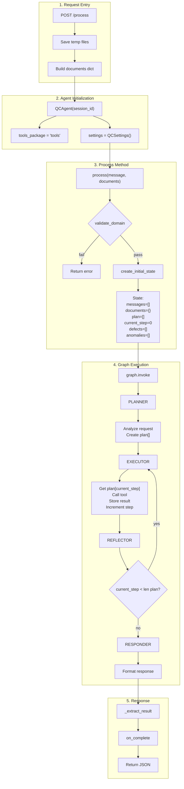
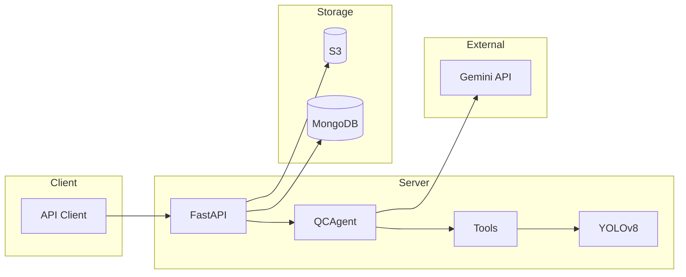
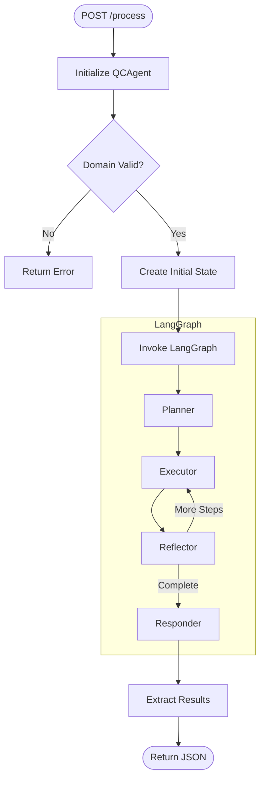
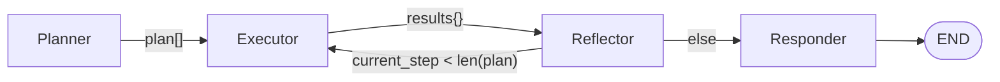
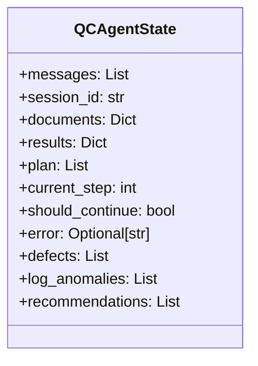
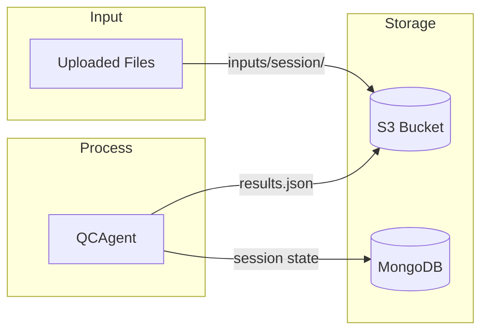

# Manufacturing QC Agent Architecture

> All diagrams verified against source code. See references below each diagram.

---

## Low-Level Agent Internals



**Source**: `agent.py`, `base.py:128-189`, `builder.py:53-64`

---

## System Overview



---

## Agent Execution Flow



**Source**: `agent/base.py:128-189`, `graph/builder.py:53-64`

---

## LangGraph Nodes



**Routing Logic** (`nodes.py:292-296`):
```python
if should_continue and current_step < len(plan):
    return "executor"
return "responder"
```

---

## State Structure



**Source**: `state.py:39-72`

---

## Tools

| Tool | Purpose | Output |
|------|---------|--------|
| `analyze_image` | YOLO defect detection (Batch Supported) | summary + defects[] |
| `analyze_logs` | Statistical anomaly detection | anomalies[] |
| `recommend_optimization` | Rule-based suggestions | recommendations[] |
| `query_knowledge` | RAG document search | context |
| `generate_report` | PDF/HTML generation | report_url |

**Source**: `tools/` directory, `agent.py:26`

---

## API Endpoints

| Method | Endpoint | Purpose |
|--------|----------|---------|
| POST | `/session/create` | Create session with SSE emitter |
| GET | `/stream/{id}` | SSE event stream |
| POST | `/process` | Analyze files |
| POST | `/chat` | Follow-up conversation |
| GET | `/sessions` | List sessions |
| GET | `/sessions/{id}` | Session details |

**Source**: `api/main.py`

---

## Storage



**Source**: `api/main.py:54-66`

---

## File Structure

```
agent/
├── agent.py          # QCAgent class
├── state.py          # QCAgentState TypedDict
├── settings.py       # Configuration
├── api/main.py       # FastAPI endpoints
├── tools/            # Tool implementations
├── vision/           # YOLOv8 wrapper
├── models/best.pt    # Trained model
└── prompts/          # LLM prompt templates
```
